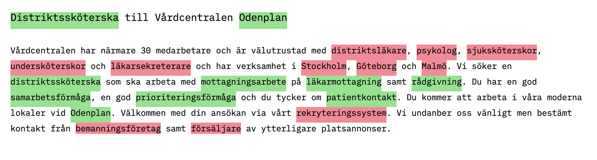

**Den 2 december bjuder JobTech Development in till webinar om JobAd Enrichments – en AI-lösning som ger bättre sökträffar i annonsplattformar och kan användas för utveckling av nya innovativa digitala tjänster för arbetsmarknaden. 
JobTech Developments Mattias Persson, ansvarig utvecklare, berättar om hur API:et fungerar och hur du kommer igång och använder det.**

I september lanserades API:et JobAd Enrichments, som förbättrar jobbannonser och effektiviserar digitala matchningstjänster. Lösningen, som är fritt tillgänglig, identifierar automatiskt ord och uttryck som är relevanta i en söksituation, samtidigt som överflödig information filtreras bort. Därmed blir det lättare att navigera och snabbt hitta rätt bland platsannonser i digitala annonsplattformar. 
Den arbetssökande slipper lägga tid på att sortera sökträffar och detaljgranska långa annonstexter för att se om de innehåller information som är intressant och relevant.  

På webinaret den 2 december berättar vår utvecklare Mattias Persson om API:et och hur du kommer igång och använder det. Vi visar också hur API:et har effektiviserat sökningarna i Platsbanken, där det redan används.

**Varmt välkommen!**

**Tid: 2 december kl 10:00 – 11:00** 
 
**Plats:**
 
**Anmälan:**  

**I vårt [forum](https://forum.jobtechdev.se) kan du ställa frågor och delta i diskussioner om JobAd Enrichments eller någon av våra andra API:er.  
 Välkommen in!** 

